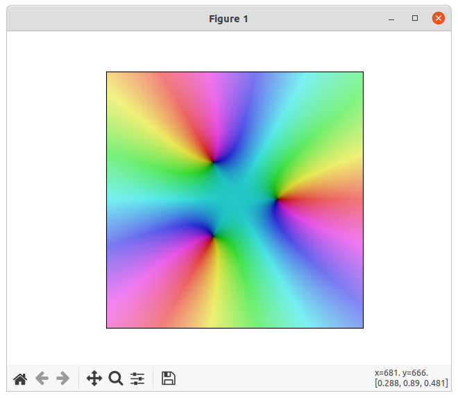
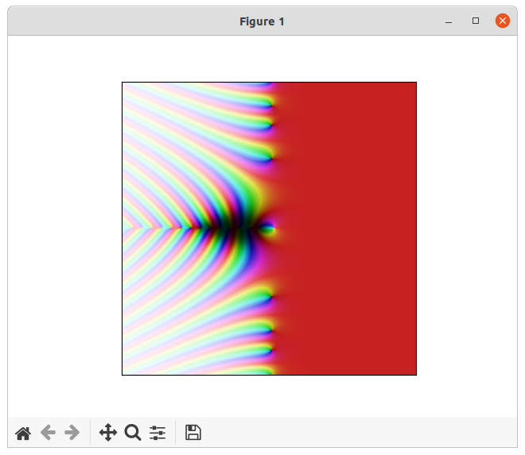

# python-domain-coloring
Domain coloring with complex functions and color functions

```python
showPlot(lambda z: z**3-1, getHSVToFindSolutions, -3, 3, 1000, -3, 3, 1000)
```

<p align="center">
  
</p>


```python
showPlot(mp.zeta, getHSVToFindSolutions, -30, 30, 1000, -30, 30, 1000)
```

<p align="center">
  
</p>